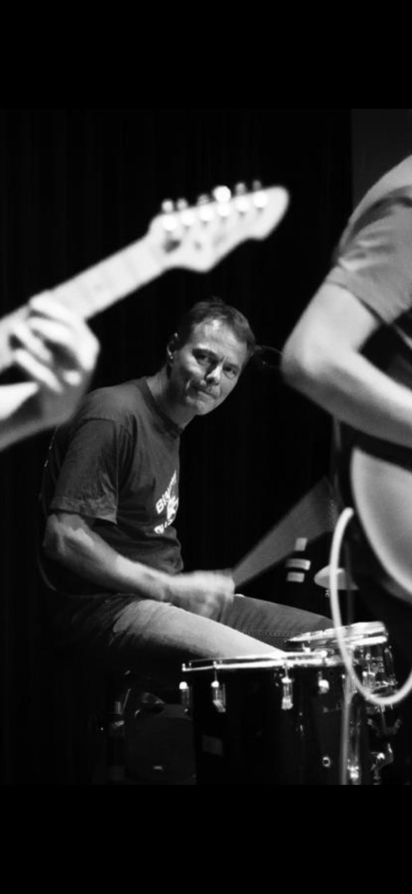
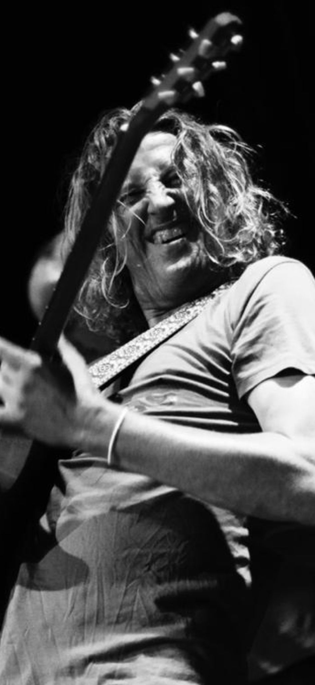
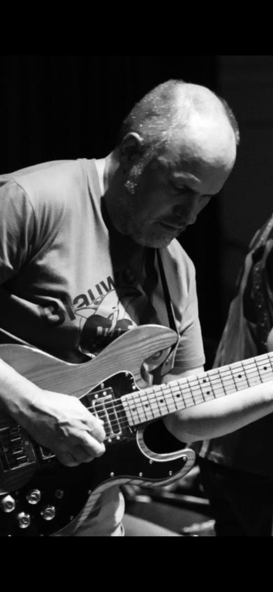
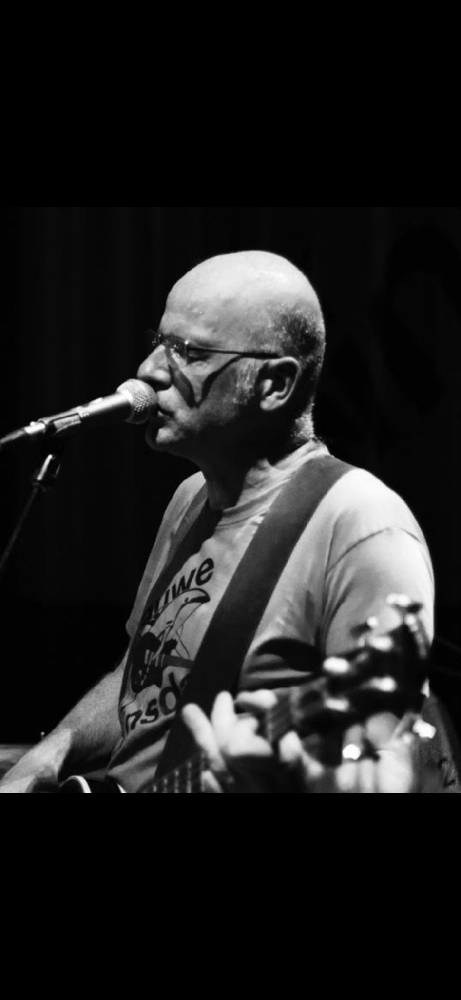

---
# Feel free to add content and custom Front Matter to this file.
# To modify the layout, see https://jekyllrb.com/docs/themes/#overriding-theme-defaults

layout: home
title: Thuis
---
 

  
  
  
  
  

  
 

 <iframe style="border-radius:12px" src="https://open.spotify.com/embed/artist/5cyFdTRpQ5A4XsQZfAZ46w?utm_source=generator&theme=0" width="98%"  frameBorder="0" allowfullscreen="" allow="autoplay; clipboard-write; encrypted-media; fullscreen; picture-in-picture" loading="lazy"></iframe>

 
 
 
