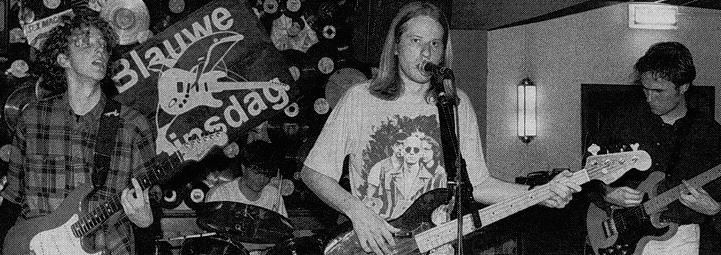
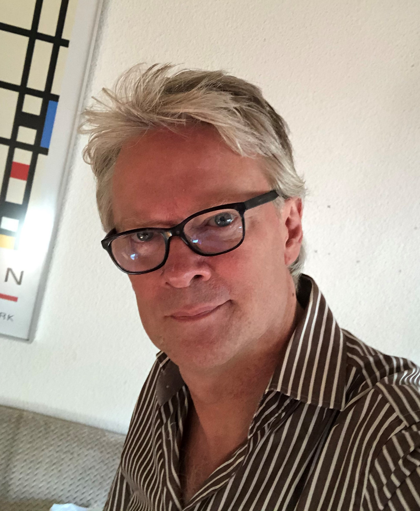

Blauwe Dinsdag is een Amsterdamse rockband die met 100% hobbieambitie liedjes over de liefde maakt. 

 
Blauwe Dinsdag werd in 1991 opgericht door Derrick Merkus (drums en achtergrondzang), Edo Kulkens (gitaar), Jaap Abbring (gitaar), Joost  Siegman (bas en zang), Wilko Bolt (gitaar) en Arno Lubrun (soort toetseninstrument). Al snel maakte Wilko promotie tot manager, hoogleraar betalingsverkeer, technicus, reisleider en foerageur en ging Arno op zoek naar een functie elders. 

Blauwe Dinsdag begon met het naspelen van andermans blues, grunge en alternatieve rock, maar schreef ook eigen, Nederlandstalige nummers. In het voorjaar van 2019 besloot Blauwe Dinsdag zich meer op eigen muziek te richten, met als voorlopig hoogtepunt [vier doorbraken op Spotify](). 

Blauwe Dinsdag [speelde op vage feestjes en in dito clubs](), vooral in 1995, maar ook nog op 2 juli 2022 in de [Jungle](https://www.jungle.amsterdam) in Amsterdam. U was en bent een fantastisch publiek! BDs digitale [museum]() zal in de toekomst al uw aan de geschiedenis van Blauwe Dinsdag gerelateerde informatiebehoeften bevredigen. 

Blauwe Dinsdag gaat al drie decennia bijna elk jaar een paar dagen op vakantie naar een cultureel verantwoorde bestemming. In dat kader [bezocht BD in november 2023 de bakermat van de westerse beschaving](), Athene.

  

Wilko Bolt

_algemeen management, betalingsverkeer, techniek, reisleiding, foerage_

[sul.management@blauwedinsdag.com](mailto:sul.management@blauwedinsdag.com)